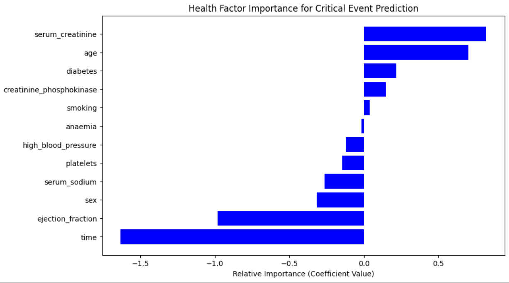

# Challenging the Complexity Paradigm: Model Comparison for Clinical Mortality Prediction

## Project Overview
This repository contains the source code and formal research paper for a comparative study between **Logistic Regression** and **Random Forest** models. The study investigates which architecture provides superior "Early Warning" sensitivity for heart failure patients[cite: 1, 2].

## Key Research Findings
Contrary to common assumptions that ensemble models are superior, this research found that a **Balanced Logistic Regression** significantly outperformed Random Forest in catching critical events.

### Performance Results
| Model | Accuracy | Recall (Class 1) | Precision (Class 1) |
| :--- | :--- | :--- | :--- |
| Unscaled Logistic | 0.78 | 0.60 | 0.83 |
| Random Forest | 0.75 | 0.48 | 0.86 |
| **Balanced Logistic** | **0.80** | **0.64** | **0.84** |

### Feature Importance
The model identified **Serum Creatinine** and **Ejection Fraction** as the most influential physiological predictors, aligning with established medical understanding

## Methodology
* **Dataset:** Heart Failure Clinical Records (n=299).
* **Preprocessing:** Implemented `StandardScaler` to resolve convergence issues.
* **Optimization:** Applied cost-sensitive learning (`class_weight='balanced'`) to prioritize patient safety (Recall).

## How to Run
1. Clone this repository.
2. Ensure you have `pandas`, `sklearn`, and `matplotlib` installed.
3. Run the Jupyter Notebook to reproduce the results.

## Contact
**Muhammad Huzaifa Saqib** Department of Software Engineering, Air University.
